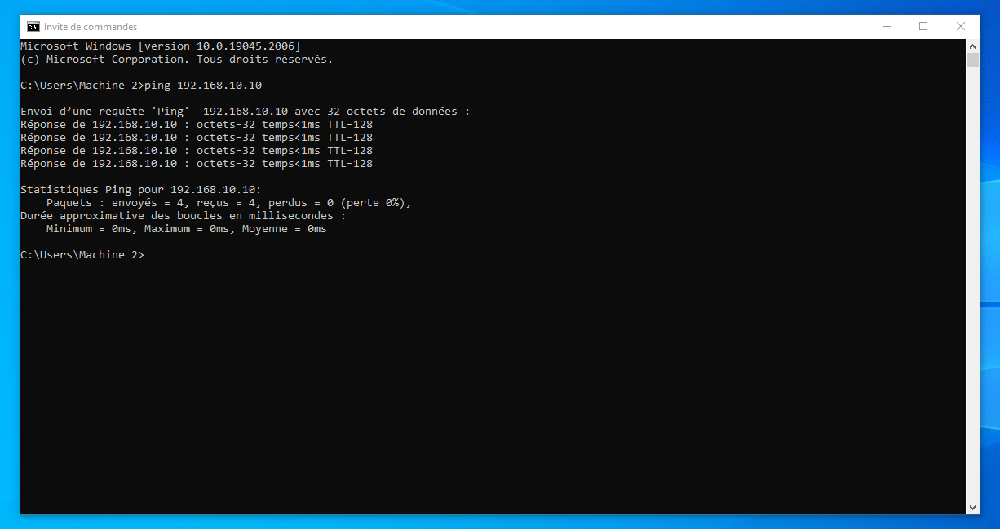

# Partie 1 : Validation de la Connectivité Réseau (Ping) et Sécurité ICMP

L'objectif de cette première phase est d'établir et de valider une connectivité réseau de base bidirectionnelle entre deux machines virtuelles Windows 10 isolées. Ce laboratoire permet de maîtriser l'isolation réseau dans un hyperviseur et la configuration précise du pare-feu Windows sans compromettre la sécurité globale du système.

## Environnement de test
* **Hyperviseur** : VMware Workstation PRO
* **VM-01 (Machine A)** : Windows 10 | IP : 192.168.10.10 /24
* **VM-02 (Machine B)** : Windows 10 | IP : 192.168.10.20 /24

## Étapes de configuration

### 1. Isolation et segmentation réseau dans l'hyperviseur
* Configuration d'un commutateur virtuel privé isolé (Host-Only / VMnet10) pour confiner le trafic à notre laboratoire.
* Modification des paramètres matériels de chaque machine virtuelle : basculement de la carte réseau (NIC) du mode NAT/Bridged vers le profil réseau personnalisé `VMnet10`.

### 2. Plan d'adressage IP statique (Couche 3 du modèle OSI)
* Accès aux connexions réseau via l'interface graphique ou la commande `ncpa.cpl`.
* Configuration manuelle des propriétés du protocole Internet version 4 (TCP/IPv4) sur les interfaces réseau :
  * **VM-01** : Adresse IP `192.168.10.10` | Masque de sous-réseau `255.255.255.0`.
  * **VM-02** : Adresse IP `192.168.10.20` | Masque de sous-réseau `255.255.255.0`.
* **Validation de l'interface** : Exécution de la commande `ipconfig` dans l'invite de commandes (CMD) de chaque VM pour valider la bonne application des paramètres IP.

### 3. Analyse du comportement initial du pare-feu (Comportement par défaut)
* **Test de connectivité initial** : Exécution d'une commande `ping 192.168.10.20` depuis la VM-01.
* **Résultat attendu** : Échec du ping ("Délai d'attente de la demande dépassé").
* **Analyse technique** : Par défaut, la stratégie de sécurité du Pare-feu Windows bloque toutes les requêtes ICMP (Internet Control Message Protocol) entrantes pour masquer la machine et la protéger contre la reconnaissance réseau.

### 4. Durcissement et configuration de la sécurité (Pare-feu Windows)
* Plutôt que de désactiver complètement le pare-feu (mauvaise pratique), ouverture de la console `wf.msc` (*Pare-feu Windows avec fonctions avancées de sécurité*).
* Navigation dans la section **Règles de trafic entrant** (*Inbound Rules*).
* Localisation et activation de la règle de sécurité native spécifique :
  * **Nom de la règle** : `Partage de fichiers et d'imprimantes (Demande d'écho - Trafic entrant ICMPv4)`.
  * **Action** : Autoriser le trafic pour les profils réseau appropriés (Privé/Domaine).

### 5. Validation finale et preuve de concept
* Réexécution de la commande `ping` bidirectionnelle entre la VM-01 et la VM-02.
* Validation de la réception des 4 paquets d'écho ICMP avec un taux de perte de 0%.

## Preuve de concept (Ping)

