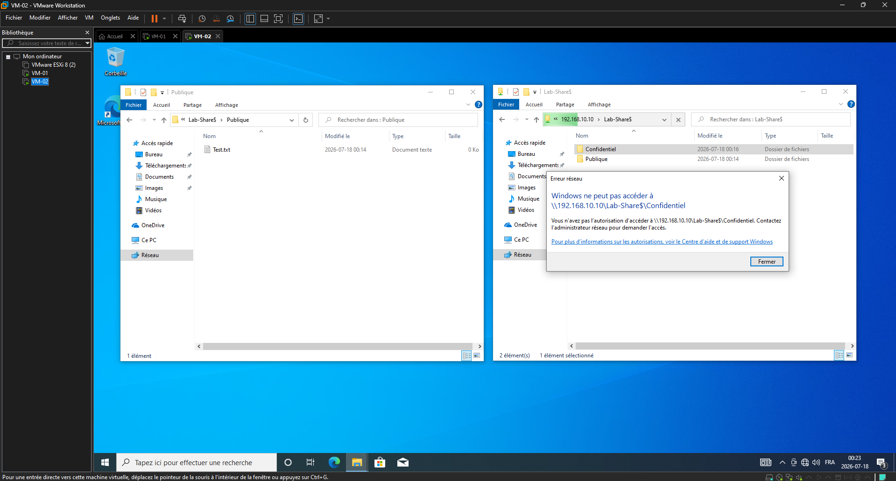

## Partie 2 : Configuration du partage de fichiers (SMB) et sécurité NTFS

L'objectif de cette deuxième phase est de monter un serveur de fichiers local sécurisé (SMB) sur la VM-01 et de valider que les accès fonctionnent correctement depuis la VM-02. Ce lab permet de comprendre comment s'articulent et se cumulent les permissions de partage et les permissions de sécurité NTFS dans un environnement Workgroup (sans domaine).

### Environnement de test
* **VM-01 (Serveur de fichiers) :** Windows 10 | IP : `192.168.10.10/24`
* **VM-02 (Client) :** Windows 10 | IP : `192.168.10.20/24`

---

### Étapes de configuration

#### 1. Création de la structure de dossiers sur VM-01
* Création d'un dossier principal nommé `C:\Lab-Partage`.
* Création de deux sous-dossiers pour tester les restrictions :
    * `C:\Lab-Partage\Public` (Accès pour les utilisateurs).
    * `C:\Lab-Partage\Confidentiel` (Accès restreint aux administrateurs).

#### 2. Gestion des comptes locaux (Workgroup)
Pour que l'authentification réseau fonctionne d'une machine à l'autre sans serveur de domaine, un compte local identique a été créé sur les deux VM :
* **Nom d'utilisateur :** `TechUser`
* **Mot de passe :** `Soleil321!`

#### 3. Configuration du partage réseau (SMB)
* Propriétés du dossier `Lab-Partage` -> Onglet **Partage** -> **Partage avancé**.
* Activation du partage sous le nom **`Lab_Share$`** (le symbole `$` sert à masquer le dossier pour qu'il n'apparaisse pas en scannant le réseau).
* Permissions de partage : Attribution du **Contrôle total** à **Tout le monde** (la sécurité fine et restrictive sera gérée à l'étape suivante par les droits NTFS).

#### 4. Configuration de la sécurité NTFS (Permissions)
* Propriétés du dossier -> Onglet Sécurité -> Avancé.
* Désactivation de l'héritage : Obligatoire pour bloquer les permissions qui descendent automatiquement du disque `C:\`. Les droits existants ont été convertis en permissions explicites pour pouvoir les modifier.
* **Configuration des accès :**
    * Pour le dossier Public : Ajout de l'utilisateur `TechUser` avec les droits de Modification (Lecture/Écriture).
    * Pour le dossier Confidentiel : Retrait complet de `TechUser` pour ne laisser que le groupe Administrateurs.

#### 5. Validation des accès depuis VM-02
* Connexion sur la VM-02 avec le compte `TechUser`.
* Ouverture de l'explorateur de fichiers et connexion via le chemin UNC : `\\192.168.10.10\Lab_Share$`.
* **Tests effectués :**
    * Écriture d'un fichier texte dans le dossier Public $\rightarrow$ Succès.
    * Tentative d'ouverture du dossier Confidentiel $\rightarrow$ Bloqué** avec un message "Accès refusé".

---

### Dépannage (Troubleshooting)

Pendant la configuration, une **erreur système 67** (chemin réseau introuvable) est apparue en essayant de se connecter depuis la VM-02. Le problème a été réglé avec ces deux vérifications sur la VM-01 :
1. **Changement du profil réseau :** Le réseau était resté en mode "Public" par défaut, ce qui bloquait le trafic SMB. Le profil a été basculé en **Privé** dans Windows, ce qui a automatiquement activé le partage de fichiers.
2. **Erreur de frappe dans le chemin :** Correction du nom de la ressource dans le chemin UNC pour taper exactement sur `Lab_Share$` (avec le tiret bas) au lieu de `Lab-Share$`.

